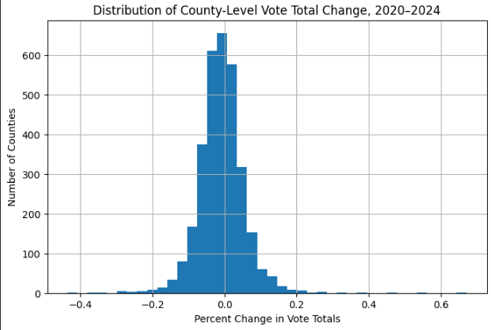
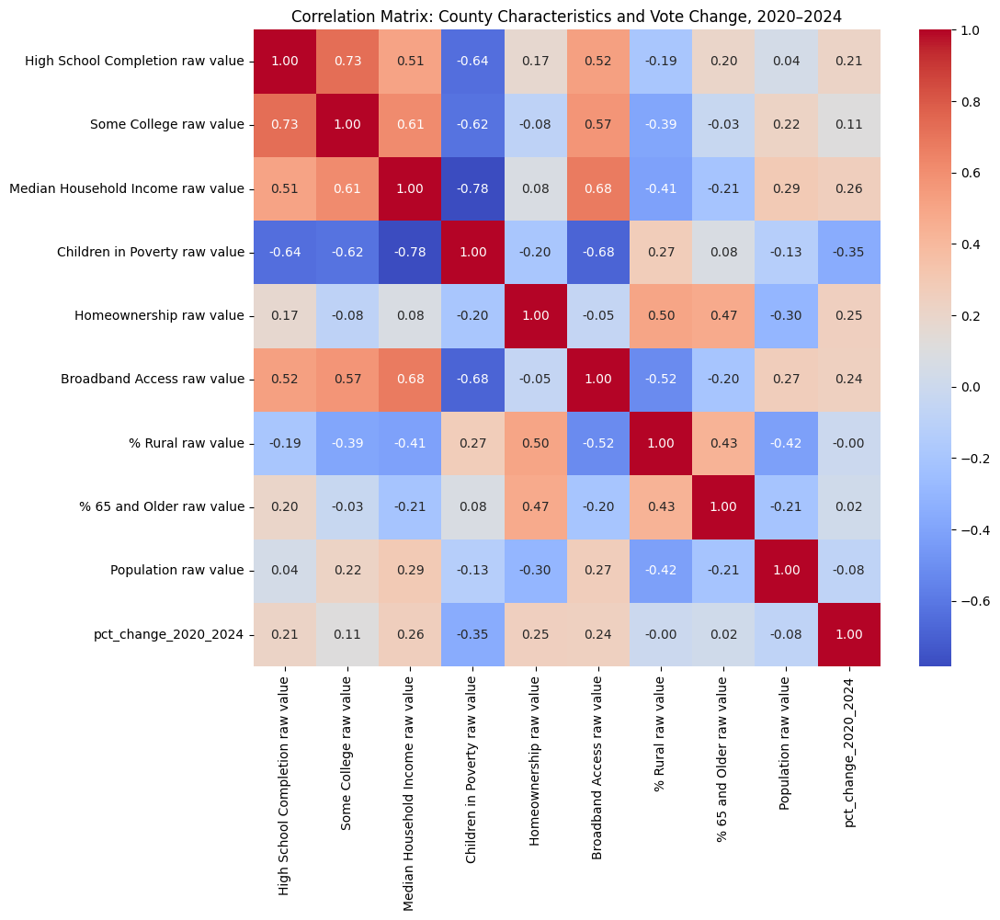
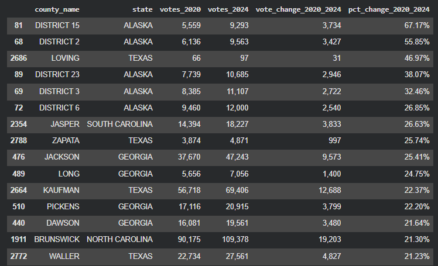
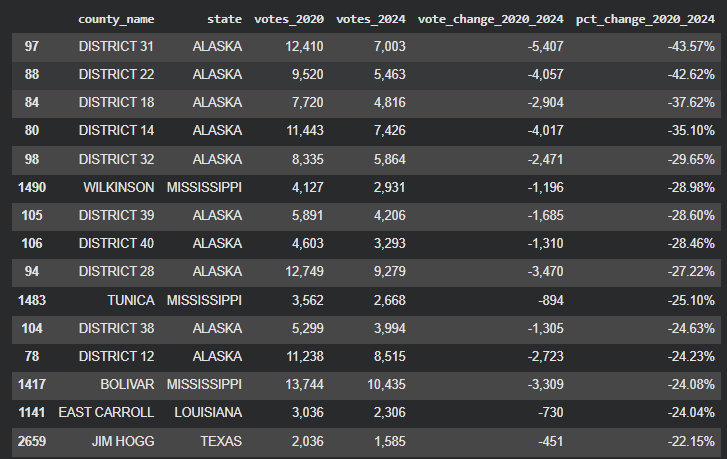
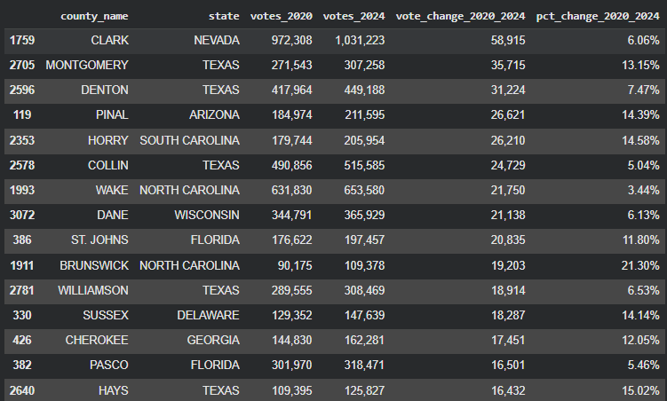
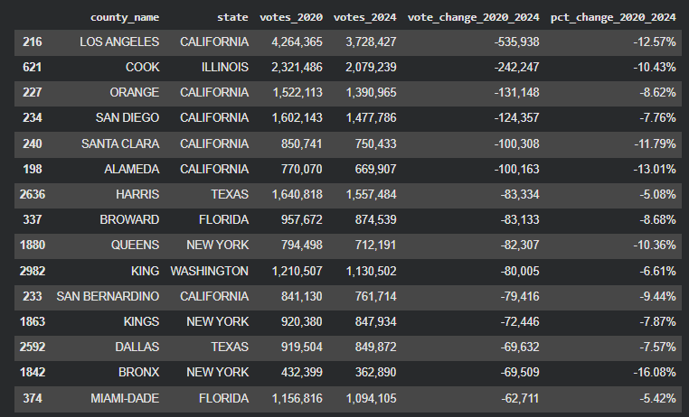
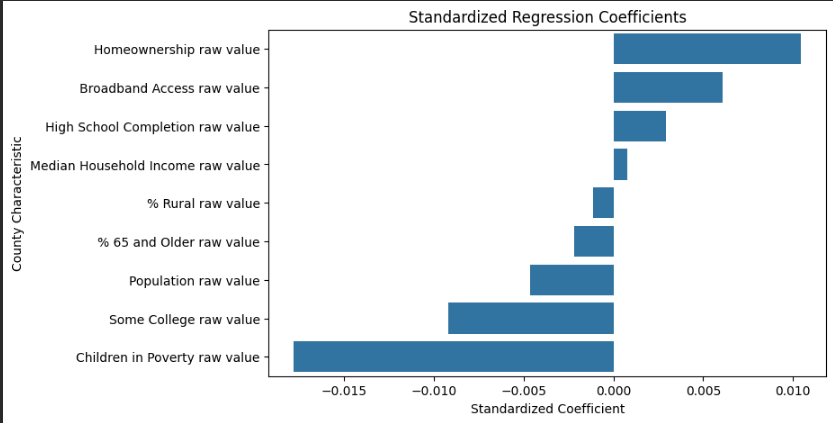

# County-Level Voter Participation Analysis (2020–2024)

## Overview

This project analyzes changes in county-level voter participation between the 2020 and 2024 U.S. Presidential Elections.

Using county-level election returns from the MIT Election Data and Science Lab (MEDSL) and demographic and socioeconomic indicators from County Health Rankings, the analysis explores patterns associated with increases and decreases in electoral participation across U.S. counties.

The goal of this project is not to determine causation, but rather to identify meaningful relationships and trends that may help explain differences in voter participation.

---

## Project Status

🚧 **Work in Progress**

### Current Progress

* Data cleaning and preparation
* County-level vote aggregation
* Participation change calculations
* Exploratory Data Analysis (EDA)
* Correlation analysis
* Regression analysis
* Initial visualizations

### Planned Additions

* Geographic analysis
* Additional model evaluation
* Expanded findings and discussion
* State-level comparisons
* Final report

---

## Research Questions

This project seeks to answer the following questions:

* How did county-level vote totals change between 2020 and 2024?
* Which counties experienced the largest increases in participation?
* Which counties experienced the largest decreases in participation?
* What county characteristics are associated with voter participation?
* What factors may help explain differences in participation across counties?

---

## Data Sources

### Election Data

**MIT Election Data and Science Lab (MEDSL)**

Dataset:

* County Presidential Election Returns (2000–2024)

Variables Used:

* County FIPS Code
* County Name
* State
* Election Year
* Total Votes Cast

### County Characteristics

**County Health Rankings**

#### Education

* High School Completion
* Some College

#### Economic Opportunity

* Median Household Income
* Children in Poverty

#### Community Stability

* Homeownership

#### Civic Access

* Broadband Access

#### Geography

* Percent Rural

#### Demographics

* Percent Age 65 and Older

#### Scale Control

* Population

---

## Tools & Technologies

* Python
* Pandas
* NumPy
* Scikit-Learn
* Matplotlib
* Seaborn
* Google Colab
* Jupyter Notebook

---

## Methodology

### 1. Data Preparation

County election returns were aggregated to the county level using total votes cast.

County FIPS codes were cleaned and standardized to ensure consistency across datasets.

### 2. Participation Change Calculation

Two participation metrics were created.

#### Raw Vote Change

```text
2024 Votes - 2020 Votes
```

#### Percent Vote Change

```text
(2024 Votes - 2020 Votes) / 2020 Votes
```

Both measures are analyzed because percentage change can exaggerate differences in counties with small populations.

### 3. Exploratory Data Analysis

The analysis includes:

* Summary statistics
* Distribution analysis
* Correlation analysis
* County-level comparisons
* Identification of counties with the largest increases and decreases in participation

### 4. Statistical Modeling

A multiple linear regression model was developed to explore which county characteristics were associated with changes in voter participation between 2020 and 2024.

Predictor variables included:

* High School Completion
* Some College
* Median Household Income
* Children in Poverty
* Homeownership
* Broadband Access
* Percent Rural
* Percent Age 65 and Older
* Population

Features were standardized using StandardScaler prior to model fitting to allow coefficient comparison.

Model performance was evaluated using R² and coefficient analysis.

---

# Visualizations

## Distribution of County-Level Vote Change



*Figure 1. Distribution of county-level changes in vote totals between 2020 and 2024.*

---

## Correlation Matrix



*Figure 2. Correlation matrix showing relationships between participation change and selected county characteristics.*

---

## Largest Percentage Increases



*Figure 3. Counties with the largest percentage increases in vote totals between 2020 and 2024.*

---

## Largest Percentage Decreases



*Figure 4. Counties with the largest percentage decreases in vote totals between 2020 and 2024.*

---

## Largest Raw Vote Increases



*Figure 5. Counties with the largest raw increases in vote totals.*

---

## Largest Raw Vote Decreases



*Figure 6. Counties with the largest raw decreases in vote totals.*

---

## Regression Coefficients



*Figure 7. Standardized regression coefficients showing relationships between county characteristics and participation change.*

---

## Preliminary Findings

### Education

Counties with higher educational attainment generally exhibited stronger voter participation outcomes.

### Income

Median household income showed a positive relationship with participation.

### Poverty

Counties with higher poverty rates generally exhibited lower participation.

### Broadband Access

Broadband availability showed a moderate positive relationship with voter participation.

### Population

Population size alone appears to explain relatively little variation in participation changes.

---

## Limitations

* Correlation does not imply causation.
* County-level data may conceal local variation.
* Total votes cast are used as a proxy for participation.
* Population growth may influence raw vote changes.
* The analysis currently focuses on a single election cycle comparison.
* The regression model is exploratory and not intended for prediction or causal inference.

---

## Future Work

Potential extensions include:

* Geographic mapping
* State-level analysis
* Multi-election trend analysis
* Additional demographic variables
* Election administration policy analysis
* Public voter registration datasets
* Absentee ballot analysis

---

## Repository Structure

```text
County-Level-Voter-Participation-Analysis/
│
├── README.md
├── Explaining_County_Level_Voter_Participation_Changes.ipynb
│
├── images/
│   ├── vote_change_distribution.png
│   ├── correlation_matrix.png
│   ├── largest_percentage_increases.png
│   ├── largest_percentage_decreases.png
│   ├── largest_raw_increases.png
│   ├── largest_raw_decreases.png
│   └── regression_coefficients.png
│
└── data/
    ├── election_data.csv
    └── county_health_rankings.csv
```

---

## Author

**Melissa Hargis**

* GitHub: [https://github.com/Tamiyo22](https://github.com/Tamiyo22)
* LinkedIn: [https://linkedin.com/in/melissa-hargis](https://linkedin.com/in/melissa-hargis)


LinkedIn: https://linkedin.com/in/melissa-hargis

Portfolio: https://melissahargis.netlify.app
